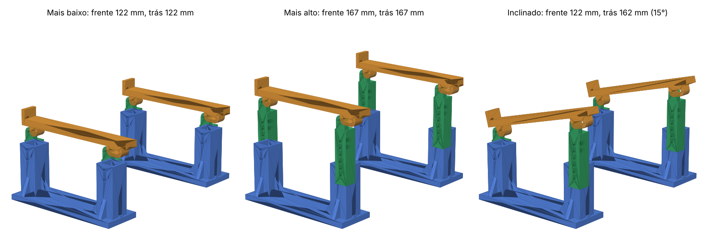

# Suporte elevado para notebook com regulagem de altura (impressão 3D)



Este suporte **eleva o notebook inteiro, na frente e atrás**. A superfície de apoio vai de
**122 mm a 167 mm** em **10 alturas, de 5 em 5 mm**. A frente e a traseira se regulam
separadamente: com as duas na mesma altura o notebook fica plano; com a traseira mais alta,
ele fica inclinado (até ~15°).

São dois módulos idênticos (esquerdo e direito). Cada módulo tem:

| Peça | Qtd./módulo | Função |
|---|:---:|---|
| **Base** (azul) | 1 | Pé largo (60 mm) com duas torres ocas, cada uma com 2 furos de trava |
| **Coluna** (verde) | 2 | Desliza dentro da torre, com 6 furos a cada 10 mm |
| **Trilho** (laranja) | 1 | Onde o notebook apoia: tem batente frontal, furo redondo na frente e rasgo atrás (para inclinar) |

## Como regular

Os furos da torre ficam a 15 mm um do outro e os da coluna a 10 mm. Combinando um furo da torre
com um furo da coluna, a altura muda de 5 em 5 mm:

| Altura do apoio | Furo da torre | Furo da coluna |
|:---:|:---:|:---:|
| 122 mm | inferior | 5 |
| 127 mm | superior | 6 |
| 132 mm | inferior | 4 |
| 137 mm | superior | 5 |
| 142 mm | inferior | 3 |
| 147 mm | superior | 4 |
| 152 mm | inferior | 2 |
| 157 mm | superior | 3 |
| 162 mm | inferior | 1 |
| 167 mm | superior | 2 |

Os furos da coluna são contados **de baixo para cima** (1 = mais perto da ponta de baixo).

- **Notebook plano:** use a mesma linha da tabela nas quatro colunas.
- **Notebook inclinado:** use uma linha mais alta nas duas colunas de trás. A traseira pode ficar
  até 55 mm mais alta que a frente.

Para regular, tire o pino da torre, suba ou desça a coluna até alinhar os furos e recoloque o pino.

## Arquivos para impressão (`stl/`)

Os STLs já estão na orientação de impressão e **não precisam de suporte**.

| Arquivo | Qtd. total | Dimensões (mm) | Observação |
|---|:---:|---|---|
| `base.stl` | 2 | 190 × 60 × 85 | Em pé, como está |
| `coluna.stl` | 4 | 101 × 20 × 20 | Deitada de lado, aba na mesa (furos verticais) |
| `trilho.stl` | 2 | 199 × 41 × 24 | De lado, bochechas na mesa (furos verticais) |
| `pino_torre.stl` | 4 | 37 × 10 × 7 | Só se não usar parafusos |
| `pino_trilho.stl` | 4 | 31 × 10 × 7 | Só se não usar parafusos |
| `trava_pino.stl` | 8 | Ø10 × 4 | Trava por pressão na ponta do pino impresso |

`montagem_*.stl` são só para visualização (não imprimir).

Tudo cabe numa mesa de 220 × 220 mm.

### Configurações recomendadas

- **Material:** PETG (preferível) ou PLA
- **Camada:** 0,2 mm · **Paredes:** 4 · **Preenchimento:** 30–40 % (giroide)
- **Suportes:** não precisa
- *Brim* de 5 mm no trilho e na coluna se a sua mesa tiver pouca aderência

## Ferragens

- 4 × parafuso **M5 × 40** com porca borboleta ou manípulo (para as torres; fácil de trocar a altura sem ferramenta)
- 4 × parafuso **M5 × 30** com porca autotravante (articulação coluna–trilho)
- Ou os pinos impressos, no lugar de qualquer um dos parafusos
- Pés de borracha adesivos sob as bases; feltro ou silicone sobre os trilhos

## Montagem

1. Encaixe as duas colunas nas torres de cada base, com as abas do topo das duas colunas
   **viradas para o mesmo lado**, e trave na altura desejada.
2. Coloque o trilho sobre as colunas, com o batente na frente. As bochechas do trilho ficam ao lado
   das abas das colunas. Prenda a frente pelo furo redondo e a traseira pelo rasgo.
   Aperte só até girar sem folga.
3. Monte o segundo módulo e posicione os dois sob o notebook (cerca de 20–25 cm entre eles),
   com a borda da frente do notebook encostada nos batentes.

## Personalização

Tudo é gerado pelo script paramétrico [`gerar_suporte.py`](gerar_suporte.py)
(Python + [manifold3d](https://github.com/elalish/manifold)):

```bash
pip install manifold3d numpy
python3 gerar_suporte.py --check   # gera os STLs, a tabela de alturas e testa colisões
```

- `TORRE_ALT`, `COL_COMP`, `FUROS_TORRE_Z`, `FUROS_COL` – faixa e passo das alturas
  (torre mais alta = faixa maior, mas altura mínima também maior)
- `BASE_LARG` – largura do pé (mais largo = mais estável)
- `TORRES_X`, `TRILHO_LARG`, `BATENTE_ALT` – distância entre colunas, largura do trilho, altura do batente
- `FURO` – diâmetro dos furos (5,4 mm para M5)

A opção `--check` monta o suporte em todas as combinações de altura da frente e da traseira e
confirma que nenhuma peça colide com outra.

> Procurando um suporte que só **inclina** o notebook (frente na mesa, traseira de 6 a 14 cm)?
> Veja [`../suporte-notebook`](../suporte-notebook).
