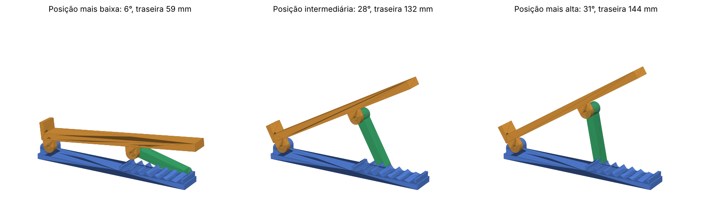

# Suporte para notebook com regulagem de altura (impressão 3D)



Um suporte articulado, impresso em 3D, que deixa a traseira do notebook entre **~6 cm e ~14 cm**
de altura (inclinação de **6° a 31°**) em **7 posições**. São dois módulos idênticos (esquerdo e
direito) — o espaço entre eles se ajusta à largura de qualquer notebook.

Cada módulo tem 3 peças:

| Peça | Função |
|---|---|
| **Base** (azul) | Fica na mesa; tem a dobradiça na frente e uma cremalheira com 7 entalhes atrás |
| **Braço** (laranja) | Onde o notebook apoia; tem um batente frontal que impede o notebook de escorregar |
| **Escora** (verde) | Liga o braço a um dos entalhes; trocar de entalhe muda a altura |

## Posições

| Entalhe (da frente p/ trás) | Inclinação | Altura da ponta traseira do braço |
|:---:|:---:|:---:|
| 1 | 31,4° | 144 mm |
| 2 | 29,8° | 140 mm |
| 3 | 27,6° | 132 mm |
| 4 | 24,6° | 123 mm |
| 5 | 20,7° | 110 mm |
| 6 | 15,4° | 91 mm |
| 7 | 6,4°  | 59 mm |

Para ajustar: levante a traseira do notebook, encaixe o pé da escora no entalhe desejado
(nos dois módulos o mesmo número) e abaixe.

## Arquivos para impressão (`stl/`)

Imprima **2 de cada** (um conjunto por lado). Os STLs já estão na orientação de impressão.

| Arquivo | Qtd. | Dimensões (mm) | Observação |
|---|:---:|---|---|
| `base.stl` | 2 | 215 × 32 × 24 | Deitada, como está |
| `braco.stl` | 2 | 225 × 41 × 24 | De lado (todos os furos ficam verticais, sem suporte) |
| `escora.stl` | 2 | 83 × 16 × 15,6 | De lado |
| `pino_dobradica.stl` + `pino_escora.stl` | 2 + 2 | 31 × 10 × 7 | Só se não usar parafusos; impressos deitados |
| `trava_pino.stl` | 4 | Ø10 × 4 | Trava por pressão na ponta do pino impresso |

`montagem_alta.stl` e `montagem_baixa.stl` são apenas para visualização (não imprimir).

Cabe em mesa de 220 × 220 mm (Ender 3, Prusa MK3/MK4, Bambu A1/P1/X1 etc.). Para mesas
menores, gire a base/braço na diagonal ou reduza `BASE_COMP` / `BRACO_COMP` no script.

### Configurações recomendadas

- **Material:** PETG (preferível) ou PLA
- **Camada:** 0,2 mm · **Paredes:** 4 · **Preenchimento:** 30–40 % (giroide)
- **Suportes:** não precisa
- Para o braço, use *brim* de 5 mm se a sua mesa tiver pouca aderência (a peça é alta e fina de lado)

## Ferragens (por suporte completo)

- 4 × parafuso **M5 × 30** + 4 × porca **M5 autotravante** (recomendado), ou os pinos impressos
- 4–6 × pés de borracha/silicone adesivos sob as bases
- Opcional: tira de feltro ou silicone sobre o braço, para não riscar o notebook

## Montagem

1. **Dobradiça:** encaixe a aba frontal do braço entre as duas orelhas da base e passe o parafuso
   (24 mm de aperto). Aperte só até as peças girarem sem folga.
2. **Escora:** encaixe o furo da escora ao lado da aba traseira do braço (a escora fica do
   lado de dentro da aba) e passe o segundo parafuso.
3. Repita para o outro módulo, cole os pés de borracha e posicione os dois módulos sob o notebook,
   alinhados com o batente frontal.

## Personalização

Tudo é gerado pelo script paramétrico [`gerar_suporte.py`](gerar_suporte.py)
(Python + [manifold3d](https://github.com/elalish/manifold)):

```bash
pip install manifold3d numpy
python3 gerar_suporte.py --check   # gera os STLs, mostra a tabela de alturas e testa colisões
```

Parâmetros principais (no topo do arquivo):

- `ENTALHES_X` – posição dos entalhes (mais entalhes = mais posições)
- `PIVO_X` / `ESCORA_COMP` – onde a escora prende no braço e o seu comprimento (mudam a faixa de alturas)
- `BRACO_COMP`, `LARG_UTIL`, `BATENTE_ALT` – tamanho do braço, largura e altura do batente frontal
- `FURO` – diâmetro dos furos (5,4 mm para M5; aumente se a sua impressora fechar furos)

A opção `--check` monta o suporte em cada posição e mede o volume de interferência entre as
peças, garantindo que nada colida ao alterar os parâmetros.
