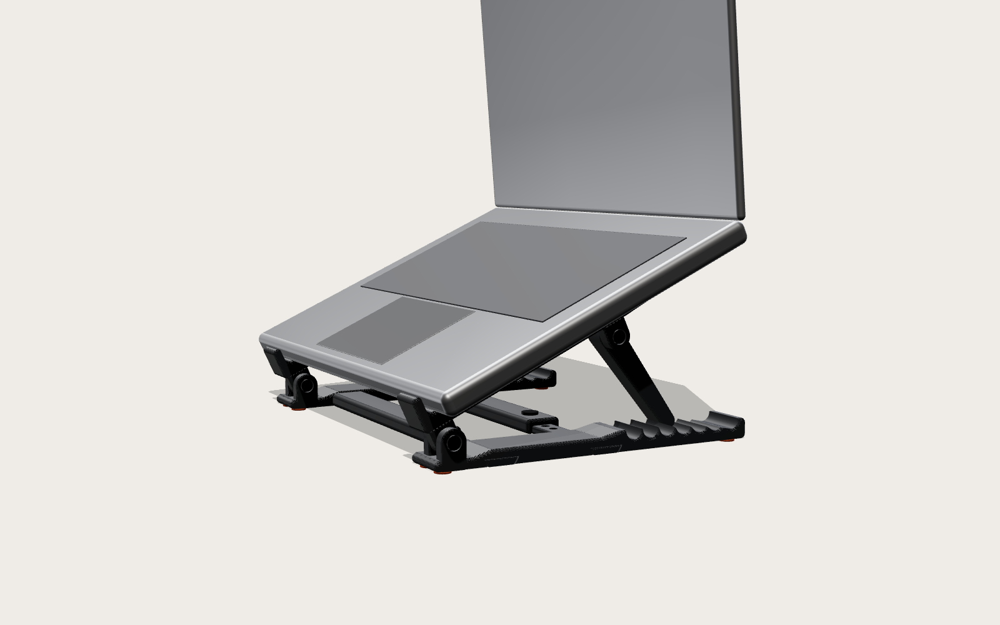
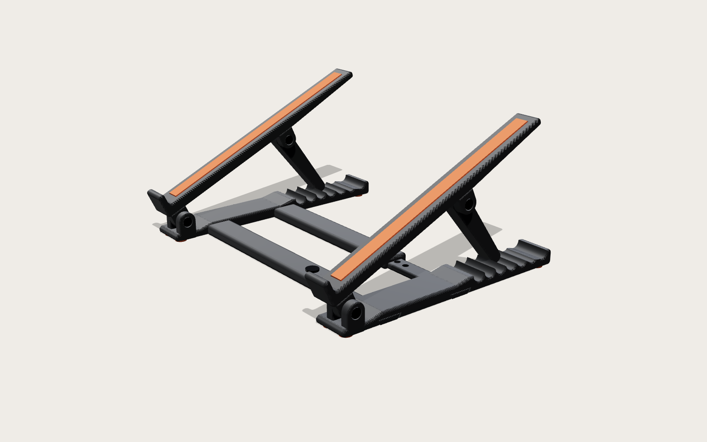
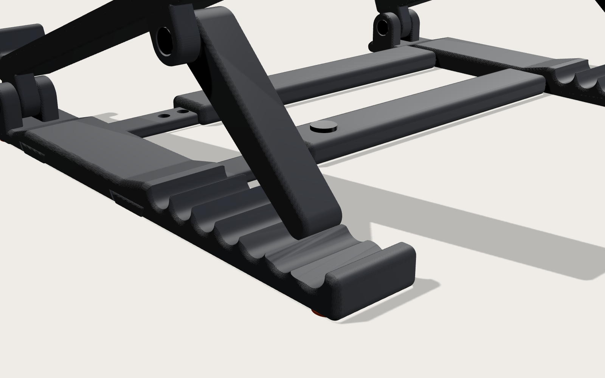
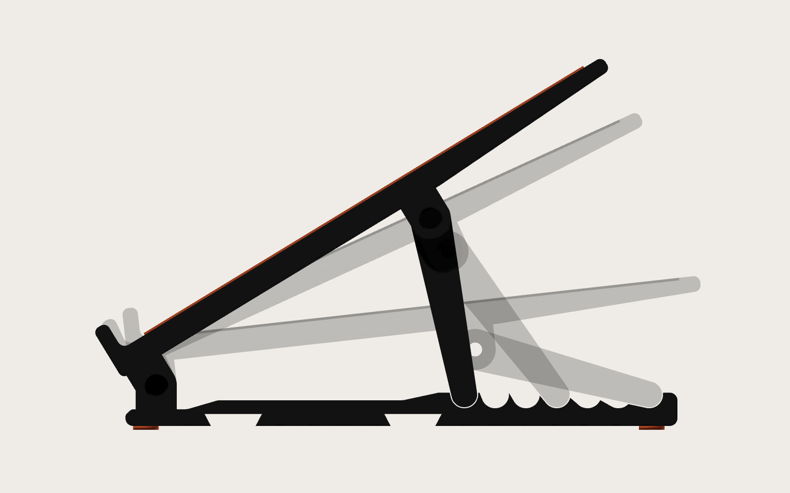

# Suporte para notebook com regulagem de altura (impressão 3D)



Suporte articulado em **grafite com detalhes em laranja**. Inclina o notebook de **6° a 31°**
(ponta traseira de 59 a 144 mm) em **7 posições**. Os dois módulos, esquerdo e direito, são
ligados por **duas travessas**: o conjunto vira uma peça só e os módulos não escorregam nem giram.
O vão entre eles se ajusta a notebooks de 13" a 17".

| | |
|:---:|:---:|
|  |  |
| Estrutura com as travessas | Cremalheira e encaixe das travessas |



## Como funciona

- **Base:** fica na mesa. Tem a dobradiça na frente e uma cremalheira com 7 entalhes arredondados atrás.
- **Braço:** é onde o notebook apoia. Tem um batente frontal e um canal com faixa de silicone
  que segura sem riscar.
- **Escora:** liga o braço a um entalhe. Para mudar a altura, levante a traseira do notebook,
  passe o pé da escora para outro entalhe e abaixe. Use o mesmo entalhe nos dois lados.
- **Travessas (frente e trás):** cada uma tem uma **haste** e uma **luva**. As pontas em
  rabo-de-andorinha entram deslizando por baixo das bases, e um pino na luva trava a largura.
  A largura se ajusta uma vez e depois fica fixa.

| Entalhe (da frente p/ trás) | 1 | 2 | 3 | 4 | 5 | 6 | 7 |
|---|:---:|:---:|:---:|:---:|:---:|:---:|:---:|
| Inclinação | 31,4° | 29,8° | 27,6° | 24,6° | 20,7° | 15,4° | 6,4° |
| Altura da ponta traseira | 144 mm | 140 mm | 132 mm | 123 mm | 110 mm | 91 mm | 59 mm |

**Vão entre as bases:** de 180 a 280 mm, de 10 em 10 mm. Uma boa regra é deixar a largura do
notebook menos uns 100 mm. Exemplo: notebook de 320 mm → vão de 220 mm.

## Arquivos para impressão (`stl/`)

Todos já estão na orientação de impressão e **nenhum precisa de suporte**.

| Arquivo | Qtd. | Dimensões (mm) | Material |
|---|:---:|---|---|
| `base.stl` | 2 | 215 × 32 × 24 | PLA Matte / PETG grafite |
| `braco.stl` | 2 | 225 × 39 × 24 | PLA Matte / PETG grafite (impresso de lado) |
| `escora.stl` | 2 | 83 × 16 × 16 | PLA Matte / PETG grafite (impresso de lado) |
| `travessa_haste.stl` | 2 | 200 × 21 × 5 | PLA Matte / PETG grafite |
| `travessa_luva.stl` | 2 | 190 × 24 × 10 | PLA Matte / PETG grafite |
| `pino_travessa.stl` | 2 | 11 × 11 × 8 | PLA / PETG (impresso deitado) |
| `tira_silicone_TPU.stl` | 2 | 200 × 11 × 2 | TPU laranja *(opcional)* |
| `pe_silicone_TPU.stl` | 8 | Ø10 × 2,5 | TPU laranja *(opcional)* |

`montagem_visualizar.stl` mostra o conjunto montado e serve só para visualizar (não imprimir).
Tudo cabe numa mesa de 220 × 220 mm.

**Configurações recomendadas:** camada de 0,16–0,2 mm, 4 paredes, 30–40 % de preenchimento
(giroide). Para o acabamento "premium" das imagens, use filamento **fosco** (PLA Matte) em
grafite e imprima o braço com *seam* (costura) alinhada atrás.

## Ferragens

- 4 × parafuso **M5 × 20 Allen** (cabeça cilíndrica) e 4 × **porca M5**. As cabeças e as porcas
  ficam embutidas nos rebaixos.
- Opcional, em vez das peças em TPU: fita de silicone adesiva de 11 mm de largura (2 × 200 mm) e
  8 pés de silicone adesivos de Ø10 mm.

## Montagem

1. **Dobradiça:** encaixe a aba frontal do braço entre as orelhas da base. Passe o parafuso pelo
   lado do rebaixo redondo e coloque a porca no alojamento sextavado do outro lado.
   Aperte só até girar sem folga.
2. **Escora:** encaixe o furo da escora ao lado da aba traseira do braço. O parafuso entra pelo
   rebaixo do braço e a porca fica embutida na escora.
3. **Silicone:** cole a faixa no canal do braço e os pés nos rebaixos sob a base.
4. **Travessas:** deslize a ponta de cada haste por baixo da base esquerda (canal rabo-de-andorinha)
   e cada luva por baixo da base direita. Encaixe a haste na luva, ajuste o vão e trave com o pino.

## Personalização

Tudo é gerado pelo script paramétrico [`gerar_suporte.py`](gerar_suporte.py)
(Python + [manifold3d](https://github.com/elalish/manifold)):

```bash
pip install manifold3d numpy
python3 gerar_suporte.py --check
```

A opção `--check` verifica três coisas:
- se alguma peça colide com outra em todos os entalhes e em todos os vãos;
- se os furos das travessas coincidem em cada vão;
- se alguma peça tem balanço que exigiria suporte na impressão.

Parâmetros principais (no topo do arquivo):
- `ENTALHES_X`, `PIVO_X`, `ESCORA_COMP`: posições e faixa de inclinação;
- `BRACO_COMP`, `LARG_UTIL`: tamanho do braço;
- `VAOS`, `HASTE_COMP`, `LUVA_COMP`: faixa de vãos das travessas;
- `FURO`, `CABECA`, `PORCA`: ajuste para a ferragem.

As imagens são geradas por [`render/`](render) (three.js no Chromium):
`python3 render/exportar_cena.py && cd render && npm install && node foto.mjs`.
